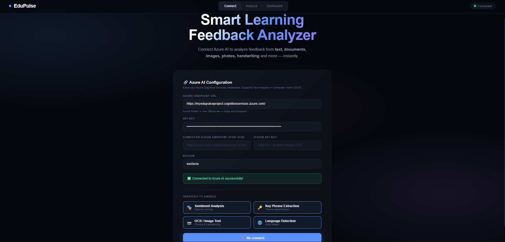
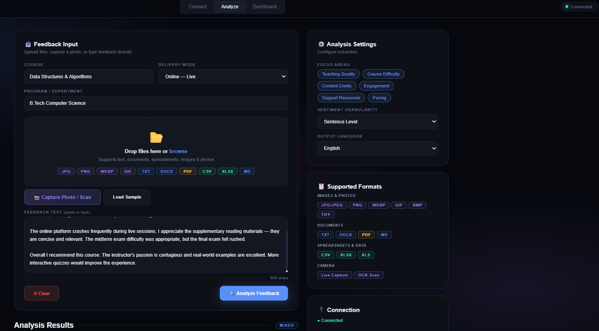
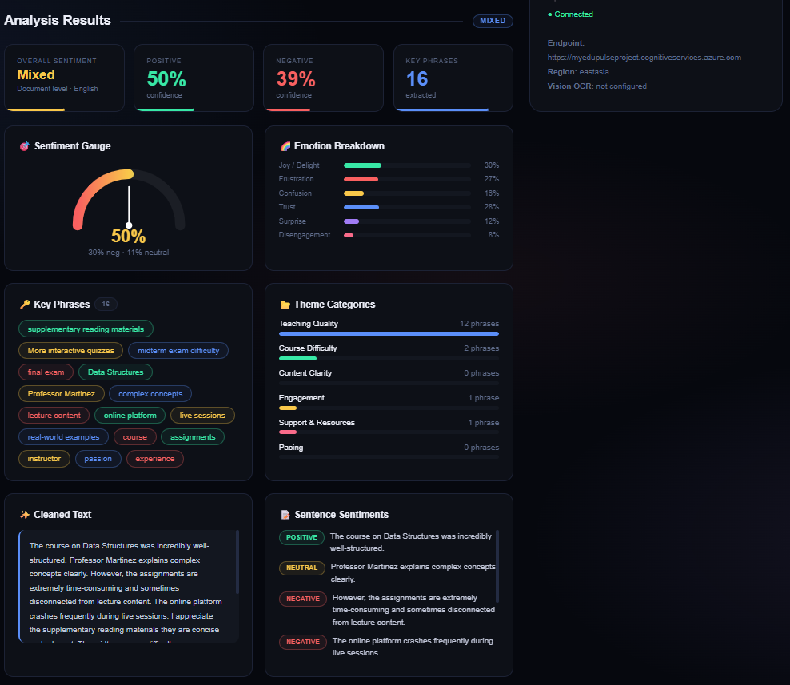
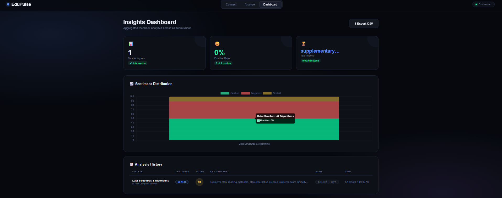

# 🚀 EduPulse – Smart Learning Feedback Analyzer

<p align="center">
  <b>AI-Powered Educational Feedback Analysis Platform using Azure Cognitive Services</b>
</p>

<p align="center">
  
  
  
  
</p>

---

## 🌟 Overview

EduPulse is a smart AI-driven platform that analyzes educational feedback from text, documents, images, and handwritten content using Azure Cognitive Services. The system provides sentiment analysis, OCR-based extraction, and intelligent insights through a modern futuristic dashboard.

The platform helps educational institutions improve learning experiences, identify student concerns, and make data-driven decisions efficiently.

---

# 📸 Project Screenshots

## 🏠 Homepage

<p align="center">
  
</p>

---

## 📝 Feedback Input

<p align="center">
  
</p>

---

## 🤖 AI Analysis

<p align="center">
  
</p>

---

## 📊 Insight Dashboard

<p align="center">
  
</p>

---

## 🚀 Features

- AI-powered sentiment analysis
- OCR support for handwritten feedback
- Image and document feedback extraction
- Azure AI integration
- Interactive modern dashboard
- Real-time feedback analysis
- Responsive futuristic UI
- Smart educational insights

---

## ☁️ Azure Services Used

- Azure AI Language Service
- Azure Cognitive Services
- Azure Computer Vision OCR
- Azure AI Studio

---

## 🛠️ Technologies Used

### Frontend

- HTML5
- CSS3
- JavaScript

### AI & Cloud Services

- Azure Cognitive Services
- Azure Text Analytics
- Azure OCR / Vision API

---

## ⚙️ Setup Instructions

### 1. Clone the Repository

```bash
git clone https://github.com/MAYANK7GUPTA-mg/EduPulse-Smart-Learning-Feedback-Analyzer.git
```

### 2. Open the Project Folder

```bash
cd EduPulse-Smart-Learning-Feedback-Analyzer
```

### 3. Run the Project

Open `index.html` using:

- Live Server (Recommended)
- VS Code
- Any local web server

### 4. Configure Azure AI

Enter:
- Azure Endpoint URL
- Azure API Key

inside the application interface.

---

## 🧠 How It Works

1. User uploads feedback through text, image, or document.
2. Azure Cognitive Services processes the content.
3. OCR extracts handwritten or image-based text.
4. Sentiment analysis identifies emotions and patterns.
5. Dashboard displays intelligent insights visually.

---

## 🎯 Use Cases

- Student feedback analysis
- Smart classroom insights
- Educational quality monitoring
- Institution performance evaluation
- AI-powered learning analytics

---

## 🔒 Security Note

Do NOT expose your Azure API key publicly.
Always use secure storage methods in production.

---

## 🌟 Future Improvements

- Voice feedback analysis
- Multi-language support
- Student performance prediction
- Advanced analytics dashboard
- Authentication system
- Cloud database integration

---

## 📂 Project Structure

```bash
EduPulse-Smart-Learning-Feedback-Analyzer/
│
├── index.html
├── HOME.png
├── FeedbackInput.png
├── Analyze.png
├── insightDashboard.png
│
├── README.md
├── LICENSE
└── .gitignore
```

---

## 👨‍💻 Developed By

### Mayank Gupta

---


---

## ⭐ Support

If you like this project, consider giving it a star on GitHub.